<b>Arnav Borkar</b>&nbsp;&nbsp;·&nbsp;&nbsp;data platforms and AI systems

The nerd in me generated this using <a href="assets/generate_terminal.py">one Python script</a>.

  

<a href="https://www.linkedin.com/in/arnavborkar/">LinkedIn</a>&nbsp;&nbsp;·&nbsp;&nbsp;<a href="https://x.com/arnavborkar">X</a>&nbsp;&nbsp;·&nbsp;&nbsp;<a href="mailto:arnav.n.borkar@gmail.com">Email</a>

  

<picture>
  <source media="(prefers-color-scheme: dark)" srcset="https://raw.githubusercontent.com/ArnavBorkar/ArnavBorkar/output/github-snake.svg">
  <source media="(prefers-color-scheme: light)" srcset="https://raw.githubusercontent.com/ArnavBorkar/ArnavBorkar/output/github-snake-light.svg">
  
</picture>

The snake is real. A <a href=".github/workflows/snake.yml">GitHub Action</a> replays it over my contribution graph every night.

<!--
  You read READMEs in raw mode. Excellent taste.

  The terminal is not a GIF and not a screenshot. It is a single SVG whose
  animation timeline is generated by assets/generate_terminal.py. Fork idea:
  point the script at your own session and make it yours.
-->
